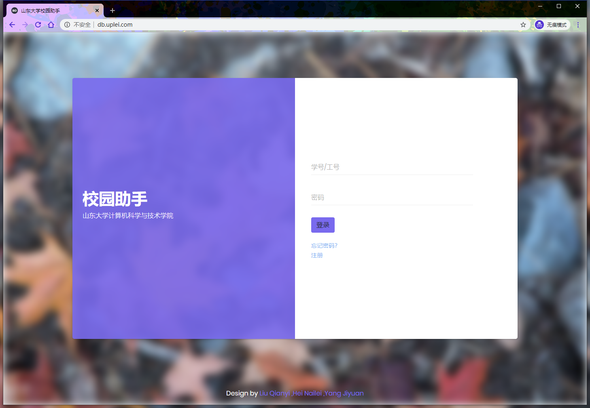
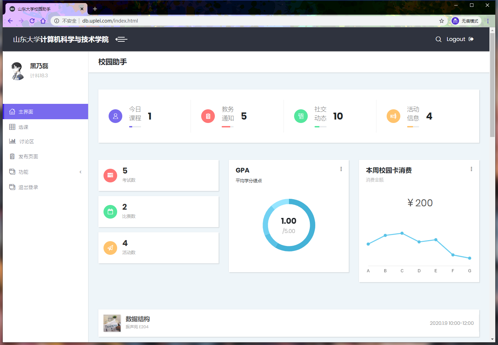
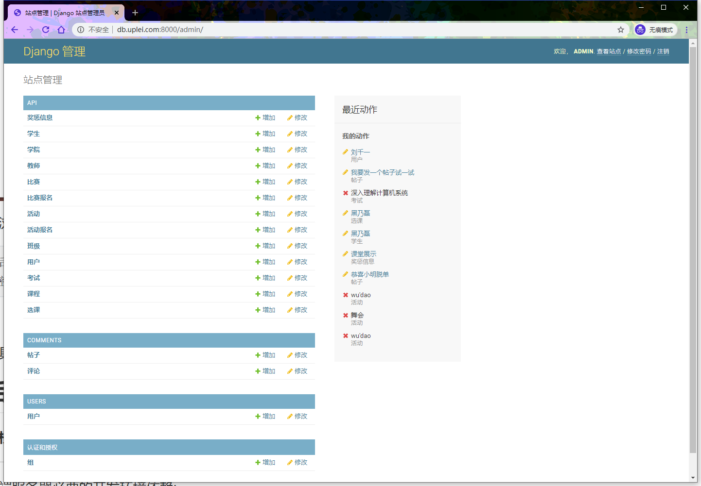

# 校园助手

本校园助手采用B/S架构。并已将其部署到服务器上。在网址上输入db.uplei.com即可访问。

[校园助手](http://db.uplei.com)

## 使用说明

在浏览器中输入db.uplei.com即可访问校园助手。
可使用如下账号体验：

```
学生界面:
账号1：123
密码1：123
账户2：201805301348
密码2：1
# --------------
教师界面：
账户：233666
密码：123
# --------------
管理员界面：
账户：0
密码：0
```



输入学生账户密码即可跳转到学生界面


输入教师账户密码即可跳转到教师界面


输入管理员账户密码即可跳转到学生界面


在浏览器中输入db.uplei.com:8000/admin即可访问后台界面，查看表中数据。

```
后台账号：admin
密码：123456
```




各个界面具体功能可见左边菜单栏，详细界面功能演示可见视频或文档。


## 后端环境依赖
**本校园助手已部署到服务器，输入网址即可浏览，下面给出的是移植项目或在本地部署项目的开发环境依赖**

------

后端服务器必要的开发环境依赖:

Python3，SQLite3，Django。

+ Python3版本不得低于Python3.7

+ SQLite3版本不得低于3.8.1
+ Django 版本不得低于2.2.0
### Python版本号查看

使用如下命令查看Python版本号：

```
python -V
```

若低于python3.7或未安装python请在官网安装

[Python官网地址](https://www.python.org/)

### Django 安装

可在命令行中使用如下命令安装django

```
pip intall django
```

### SQLite3 安装

输入sqlite3查看版本号

若未安装sqlite3或版本号低于3.8.1请在官网安装

[Sqlite3官网地址](https://www.sqlite.org/index.html)

### 必要环境依赖

开发时采用了第三方库 libgravatar 和 django-cors-headers

```
pip install django-cors-headers
pip install libgravatar
```

## 后端服务器部署

在/dbserver/目录下执行如下指令即可启动后端服务器:

```
python manage.py runserver
```


后台输入localhost:8000/admin即可进入，后台可以查看所有模型/表中的数据项。

后台账号：

```
账户：admin
密码：123456
```

## 浏览前端网站

在/html/文件里点击login.html即可。

这里要注意的是，给出的代码请求端口均为远程服务器。若想连接本地服务器，需要把Ajax请求中的49.235.169.238替换为localhost


## dbserver目录介绍

dbserver分为API和comments两个目录。

其中后端服务器基本信息设置位于dbproject目录下的settings.py，url设置位于urls.py

[服务器设置](./dbserver/dbproject/settings.py)

[url设置](./dbserver/dbproject/urls.py)

### API

API目录下为大部分的事务和数据库模型的创建

其模型，请求，视图位于系统的/dbserver/api文件夹下:

[模型models](./dbserver/api/models.py)

[请求urls](./dbserver/api/urls.py)

[事务/视图views](./dbserver/api/views.py)

### comments
comments为评论区相关功能：
其模型，请求，视图位于/dbserver/comments文件夹下:

[模型models](./dbserver/api/models.py)

[请求urls](./dbserver/api/urls.py)

[事务/视图views](./dbserver/api/views.py)